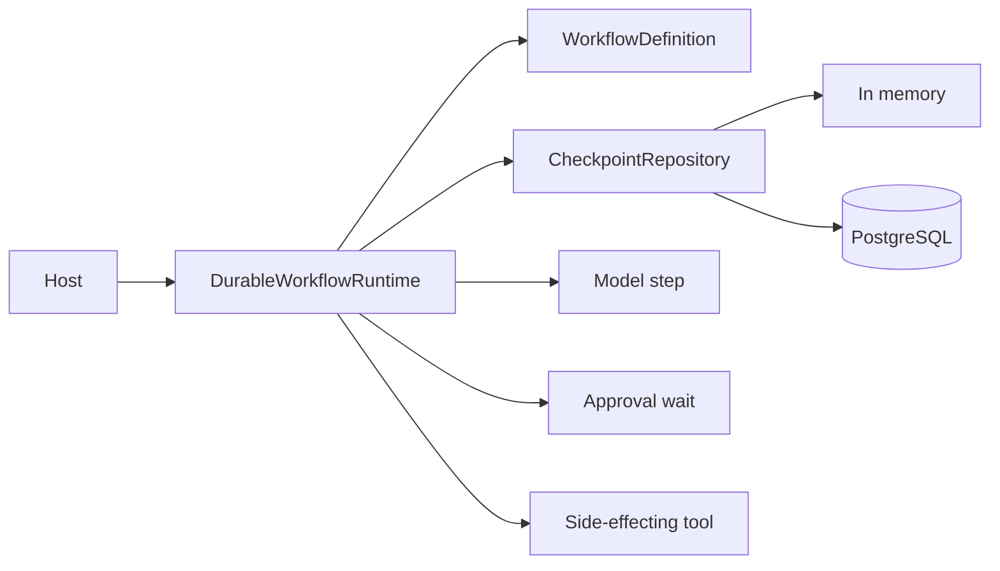
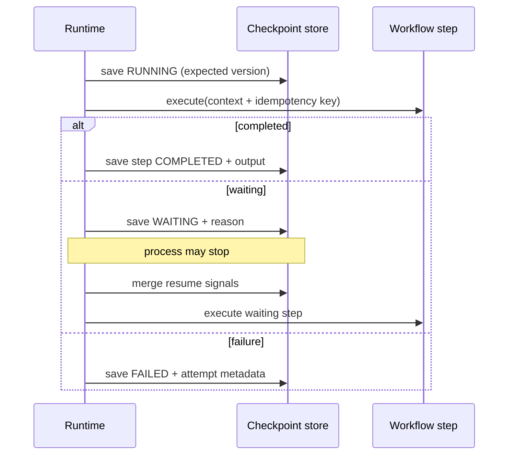

# Spring AI Durable Runtime

Spring AI Durable Runtime checkpoints explicit Java workflow steps so long-running model and tool sequences can pause, restart, resume, fail, or cancel without repeating a previously committed step.

## Problem Statement

Multi-step agents can stop after expensive model calls, side effects, or approval requests. Starting from the beginning repeats work and can duplicate external effects. A durable runtime must expose exactly where state becomes committed rather than hiding recovery behind annotations.

## What This Project Solves

- workflow and execution identities
- `STARTED`, `RUNNING`, `WAITING`, `COMPLETED`, `FAILED`, and `CANCELLED` execution states
- per-step pending, running, waiting, completed, and failed checkpoints
- human approval signals through pause and resume
- attempt metadata and failure type capture
- stable `executionId:stepId` idempotency keys
- optimistic checkpoint versions for single-writer safety
- concurrent in-memory and JDBC/PostgreSQL repositories
- deterministic restart tests with fake model and tool steps

## When To Use It

Use it for explicit, ordered Java AI workflows whose steps can be safely retried with an idempotency key and whose state must survive process replacement. It is intentionally smaller than a general workflow orchestrator.

## Architecture / HLD



## Detailed Design / LLD



A step is considered committed only after its completed checkpoint is saved. On restart, the runtime reads `currentStep` and never invokes an earlier completed step. A crash between an external side effect and checkpoint commit can still cause replay; external effects must honor `StepContext.idempotencyKey()`.

## Public API / API Structure

| Type | Purpose |
| --- | --- |
| `WorkflowDefinition` / `StepDefinition` | Ordered, uniquely named workflow steps |
| `WorkflowStep` / `StepOutcome` | Explicit execution and completed/waiting result |
| `StepContext` | Prior checkpoints, resume signals, and idempotency key |
| `ExecutionCheckpoint` | Persisted workflow state and optimistic version |
| `CheckpointRepository` | Persistence contract |
| `InMemoryCheckpointRepository` | Thread-safe local implementation |
| `JdbcCheckpointRepository` | JDBC adapter using PostgreSQL-compatible SQL |
| `DurableWorkflowRuntime` | Start, run, resume, and cancel operations |

## Core Concepts

Checkpoint-before-call marks a step running; checkpoint-after-call commits its output. Resume signals are persisted before a waiting step is invoked again. Repository updates compare an expected version, so concurrent stale writers fail with `CheckpointConflictException`.

Step outputs and signals are JSON-compatible maps. The JDBC adapter stores one JSON document per execution, making recovery atomic and schema evolution visible to the application.

## Local Prerequisites

- JDK 21 or newer
- Git
- network access for initial Maven dependency resolution
- PostgreSQL for production use of the JDBC adapter

The Maven Wrapper pins Maven 3.9.12.

## Steps To Run

```bash
git clone https://github.com/aniket-deshkar/spring-ai-durable-runtime.git
cd spring-ai-durable-runtime
./mvnw verify
```

Use `mvnw.cmd verify` on Windows.

## Configuration

Create a repository, supply a `Clock`, and retain the same `WorkflowDefinition` name and step order for an execution. For JDBC, construct `JdbcCheckpointRepository` with a `DataSource` and `ObjectMapper`, then call `initialize()` during controlled startup or manage the equivalent table with migrations.

The PostgreSQL table is `ai_workflow_checkpoint(execution_id, version, payload)`. Configure connection pooling, transaction timeouts, encryption, and retention in the host application.

## Usage Examples

```java
WorkflowDefinition workflow = new WorkflowDefinition("review", List.of(
    new StepDefinition("model", ctx ->
        StepOutcome.completed(Map.of("draft", model.generate()))),
    new StepDefinition("approval", ctx ->
        ctx.signals().containsKey("approved")
            ? StepOutcome.completed(Map.of())
            : StepOutcome.waiting("human approval")),
    new StepDefinition("publish", ctx -> {
      publisher.send(ctx.idempotencyKey());
      return StepOutcome.completed(Map.of("published", true));
    })));

DurableWorkflowRuntime runtime =
    new DurableWorkflowRuntime(repository, Clock.systemUTC());
runtime.start("execution-42", workflow);
ExecutionCheckpoint state = runtime.run("execution-42", workflow);
runtime.resume("execution-42", workflow, Map.of("approved", true));
```

## Testing

Run `./mvnw verify`. Eight tests cover crash/restart around approval checkpoints, stable idempotency keys, failure metadata, cancellation, duplicate executions, stale writes, invalid definitions, terminal stability, and JDBC round trips in PostgreSQL compatibility mode. Spotless and PMD are part of the gate, and GitHub Actions builds on Java 21.

## Observability

Execution status, current step, attempts, failure class, version, and update time are available from each checkpoint. Emit metrics and traces at the host boundary without attaching raw outputs or signals. Version conflicts should be counted because they indicate multiple active workers.

## Security

Checkpoint payloads can contain model outputs, tool results, and approval signals. Apply database access controls, encryption, retention, and application-level redaction. Do not put credentials in outputs or signals. Treat resume authorization as a host responsibility and validate that the caller may approve the execution.

See [SECURITY.md](SECURITY.md).

## Repository Structure

```text
src/main/java/.../durable/   Runtime, state model, and repositories
src/test/java/.../durable/   Recovery and persistence tests
.github/workflows/ci.yml     Java 21 verification
pom.xml                      Build and quality configuration
```

## Design Decisions / Trade-offs

- Ordered explicit steps keep recovery semantics inspectable but do not model arbitrary graphs.
- JSON documents make checkpoint writes atomic but require planned schema compatibility.
- Optimistic versions prevent stale overwrites; they do not elect a distributed worker.
- Idempotency keys make the side-effect boundary explicit because a database checkpoint cannot atomically commit an arbitrary remote tool action.
- Failure is terminal in v0.1.0; a caller can start a new execution using recorded attempt metadata and business policy.

## Contributing

Follow [CONTRIBUTING.md](CONTRIBUTING.md) and include deterministic restart and failure-semantics tests with every durability change.

## License

Apache License 2.0. See [LICENSE](LICENSE).
